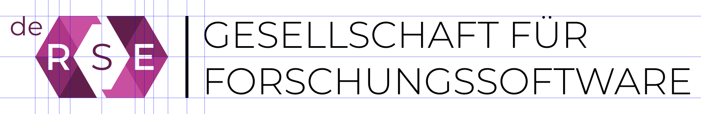

# Logo *de-RSE e.V. - Gesellschaft für Forschungssoftware*

This repository holds the logo for 
[de-RSE e.V. - Gesellschaft für Forschungssoftware](https://de-rse.org).

It is provided in two SVG files:

- [de-RSE-logo-colour.svg](de-RSE-logo-colour.svg), containing the colour version of the logo
- [de-RSE-logo-grayscale.svg](de-RSE-logo-grayscale.svg), containing the grayscale version of the logo

The logo is in the public domain, licensed under a 
[Creative Commons CC0 1.0 Universal (CC0 1.0) Public Domain Dedication License](https://creativecommons.org/publicdomain/zero/1.0/), see [LICENSE.md](LICENSE.md).

It has been created by [Daniel Beiter](https://github.com/baender) with contributions from the
[community](https://github.com/DE-RSE/logo-association/graphs/contributors).

## Concept

The logo plays on the nature of RSE as an intersection of software-enabled 
research and software engineering. 

Graphically transforming this intersection into a GIS-inspired 
[XOR](https://en.wikipedia.org/wiki/Exclusive_or) 
[overlay](https://en.wikipedia.org/wiki/Geographic_information_system#Map_overlay), 
it can be nicely combined with the Research Software Engineering acronym *RSE*.

The [Venn](https://en.wikipedia.org/wiki/Venn_diagram)-like circular shapes can 
be replaced with a more computation-related 
form, the [hexagon](https://en.wikipedia.org/wiki/Hexagon), which is reminiscent 
of symbols used for *code* or *coding*: `</>`.

Subsequently enlarging the intersection may symbolize the importance and growing 
awareness of Research Software Engineering, as driven by the international RSE
community.

Finally, the re-introduction of a "hooked" link between the "Research" and 
"Engineering" constituents hints at the crucial collaborative efforts between 
the research and the software engineering communities (itself a research 
community), which materialize in Research Software Engineering.

The colour version of the logo acknowledges the pioneering role of the [UK
Research Software Engineering community and its association](https://rse.ac.uk/), 
by taking up its colour scheme.

The final version of the logo is based on simple geometries, is easy to draw,
can be represented in colour, grayscale and b/w, transports the RSE concept 
through its intersectionary nature, plays on computing symbolism (`< >`), can
be represented as ASCII art, `<R<S>E>`, and uses an openly licensed fonts:

- The lightweight [Montserrat](https://github.com/JulietaUla/Montserrat) font 
(SIL Open Font License 1.1) contrasts the bulky main logo.

The *de* prefix can be easily replaced by other 
[ISO 639-1](https://en.wikipedia.org/wiki/ISO_639-3) codes, making the logo 
easily re-usable by other national RSE associations.

We provide the logo as two SVG files:

- [de-RSE-logo-colour.svg](de-RSE-logo-colour.svg), containing the colour version of the logo
- [de-RSE-logo-grayscale.svg](de-RSE-logo-grayscale.svg), containing the grayscale version of the logo

## Specifications

The *de* lowercase superscript prefix is set in Montserrat Normal at 14pt. The upper bound
of the letter *d* aligns horizontally with the upper bound of the "hexagon" logo.
The center of the letter *e* aligns vertically with the left bound of the
"hexagon" logo.

The letters *R* and *E* cutouts in the "hexagon" logo are based on the respective 
Montserrat Semi-Bold 20pt letters.

The *S* in the "hexagon" logo is set in Montserrat Normal at 20pt.

The centres of letters *RSE* are aligned with the horizontal centre of the
"hexagon" logo, the centre of the letter *S* is aligned vertically with the the 
vertical centre of the "hexagon" logo, and those of *R* and *E* are aligned
vertically with the upper and lower left and right corners of the "hexagon" logo.

The colour values of the purple tiles of the "hexagon" logo are (RGBA)

- R 201, G 79, B 160, A 255 (`c94fa0ff`, left upper, right lower, grayscale: `737373ff`)
- R 176, G 54, B 134, A 255 (`b03686ff`, left upper mid, right lower mid, grayscale: `595959ff`)
- R 137, G 42, B 105, A 255 (`892a69ff`, left lower mid, right upper mid, grayscale: `404040ff`)
- R 98, G 30, B 75, A 255 (`621e4bff`, left lower, right upper, grayscale: `262626ff`)

The vertical dividing rule aligned horizontally with the upper and lower bounds
of the "hexagon" logo. Its colour is black (`000000ff`). It is centred vertically
between the "hexagon" logo and the text "GESELLSCHAFT FÜR FORSCHUNGSSOFTWARE".

The text "GESELLSCHAFT FÜR FORSCHUNGSSOFTWARE" is set in Montserrat Light at 20pt,
with a line-spacing of 1.25. It is black (`000000ff`), and centre-aligned with
the "hexagon" logo.

