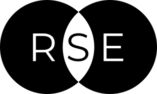
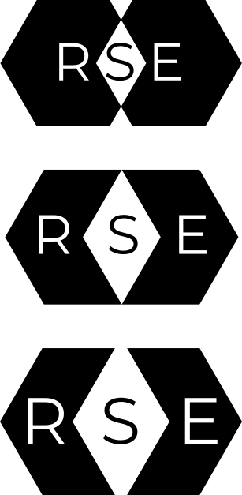
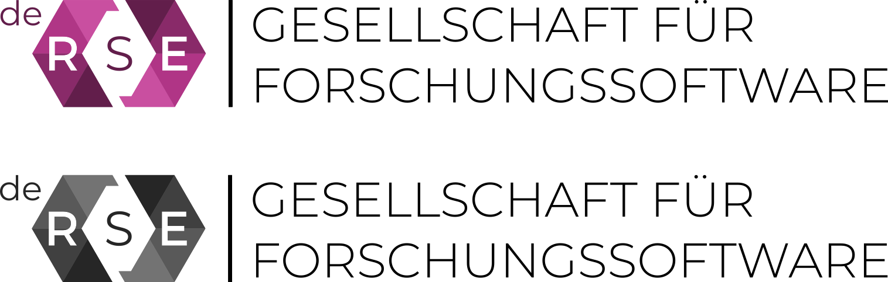

# Logo *de-RSE e.V. - Gesellschaft für Forschungssoftware*

This repository holds the logo for 
[de-RSE e.V. - Gesellschaft für Forschungssoftware](https://de-rse.org).

![RSE_logo.svg]

The logo is in the public domain, licensed under a 
[Creative Commons CC0 1.0 Universal (CC0 1.0) Public Domain Dedication License](https://creativecommons.org/publicdomain/zero/1.0/), see <LICENSE.md>.

It has been created by [Daniel Beiter](@baender) with contributions from the
[community](https://github.com/DE-RSE/logo-association/graphs/contributors).

## Concept

The logo plays on the nature of RSE as an intersection of software-enabled 
research and software engineering. 

Graphically transforming this intersection into a GIS-inspired 
[XOR](https://en.wikipedia.org/wiki/Exclusive_or) 
[overlay](https://en.wikipedia.org/wiki/Geographic_information_system#Map_overlay), 
it can be nicely combined with the Research Software Engineering acronym *RSE*.

The [Venn](https://en.wikipedia.org/wiki/Venn_diagram)-like circular shapes can 
be replaced with a more computation-related 
form, the [hexagon](https://en.wikipedia.org/wiki/Hexagon), which is reminiscent 
of symbols used for *code* or *coding*: `</>`.

Subsequently enlarging the intersection may symbolize the importance and growing 
awareness of Research Software Engineering, as driven by the international RSE
community.

Finally, the re-introduction of a "hooked" link between the "Research" and 
"Engineering" constituents hints at the crucial collaborative efforts between 
the research and the software engineering communities (itself a research 
community), which materialize in Research Software Engineering.

The colour version of the logo acknowledges the pioneering role of the [UK
Research Software Engineering community and its association](https://rse.ac.uk/), 
by taking up its colour scheme.

The final version of the logo is based on simple geometries, is easy to draw,
can be represented in colour, grayscale and b/w, transports the RSE concept 
through its intersectionary nature, plays on computing symbolism (`< >`), can
be represented as ASCII art, `<R<S>E>`, and uses openly licensed fonts:

- The lightweight [Montserrat](https://github.com/JulietaUla/Montserrat) font 
(SIL Open Font License 1.1) contrasts the bulky main logo.
- The [Datalegreya](https://github.com/figs-lab/datalegreya) font (SIL Open Font 
License 1.1) - "the typeface that melts text and data visualisation" - is used 
for the *R* and *E* letters of the logo.

The *de* prefix can be easily replaced by other 
[ISO 639-1](https://en.wikipedia.org/wiki/ISO_639-3) codes, making the logo 
easily re-usable by other national RSE associations.

We provide the logo as two SVG files:

- <de-RSE-logo-colour.svg>, containing the colour version of the logo
- <de-RSE-logo-grayscale.svg>, containing the grayscale version of the logo