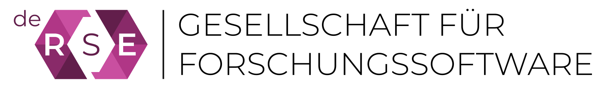
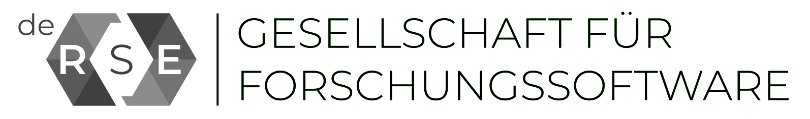
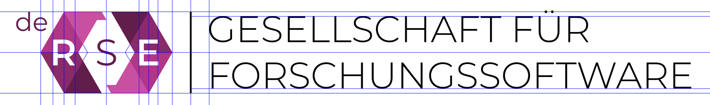

# Logo *de-RSE e.V. - Gesellschaft für Forschungssoftware*

This repository holds the logo for 
[de-RSE e.V. - Gesellschaft für Forschungssoftware](https://de-rse.org).

It is provided in four SVG files:

- [de-RSE-logo-text-colour.svg](de-RSE-logo-text-colour.svg), containing the colour version of the logo
- [de-RSE-logo-text-grayscale.svg](de-RSE-logo-text-grayscale.svg), containing the grayscale version of the logo
- [de-RSE-logo-only-colour.svg](de-RSE-logo-only-colour.svg), containing the colour version of the logo without text
- [de-RSE-logo-only-grayscale.svg](de-RSE-logo-only-grayscale.svg), containing the grayscale version of the logo without text

The logo is in the public domain, licensed under a 
[Creative Commons CC0 1.0 Universal (CC0 1.0) Public Domain Dedication License](https://creativecommons.org/publicdomain/zero/1.0/), see [LICENSE.md](LICENSE.md).

It has been created by [Daniel Beiter](https://github.com/baender) with contributions from the
[community](https://github.com/DE-RSE/logo-association/graphs/contributors).

## Concept

The logo plays on the nature of RSE as an intersection of software-enabled 
research and software engineering. 

Graphically transforming this intersection into a GIS-inspired 
[XOR](https://en.wikipedia.org/wiki/Exclusive_or) 
[overlay](https://en.wikipedia.org/wiki/Geographic_information_system#Map_overlay), 
it can be nicely combined with the Research Software Engineering acronym *RSE*.

The [Venn](https://en.wikipedia.org/wiki/Venn_diagram)-like circular shapes can 
be replaced with a more computation-related 
form, the [hexagon](https://en.wikipedia.org/wiki/Hexagon), which is reminiscent 
of symbols used for *code* or *coding*: `</>`.

Subsequently enlarging the intersection may symbolize the importance and growing 
awareness of Research Software Engineering, as driven by the international RSE
community.

Finally, the re-introduction of a "hooked" link between the "Research" and 
"Engineering" constituents hints at the crucial collaborative efforts between 
the research and the software engineering communities (itself a research 
community), which materialize in Research Software Engineering.

The colour version of the logo acknowledges the pioneering role of the [UK
Research Software Engineering community and its association](https://society-rse.org/), 
by taking up its colour scheme.

The final version of the logo is based on simple geometries, is easy to draw,
can be represented in colour, grayscale and b/w, transports the RSE concept 
through its intersectionary nature, plays on computing symbolism (`< >`), can
be represented as ASCII art, `<R<S>E>`, and uses an openly licensed fonts:

- The lightweight [Montserrat v7.200](https://github.com/JulietaUla/Montserrat/releases/tag/v7.200)
(SIL Open Font License 1.1) contrasts the bulky main logo.

The *de* prefix can be easily replaced by other 
[ISO 639-1](https://en.wikipedia.org/wiki/ISO_639-3) codes, making the logo 
easily re-usable by other national RSE associations.

## Specifications

The *de* lowercase superscript prefix is set in Montserrat Normal at 14pt. The upper bound
of the letter *d* aligns horizontally with the upper bound of the "hexagon" logo.
The center of the letter *e* aligns vertically with the left bound of the
"hexagon" logo.

The letters *R* and *E* cutouts in the "hexagon" logo are based on the respective 
Montserrat Semi-Bold 20pt letters.

The *S* in the "hexagon" logo is set in Montserrat Normal at 20pt.

The centres of letters *RSE* are aligned with the horizontal centre of the
"hexagon" logo, the centre of the letter *S* is aligned vertically with the the 
vertical centre of the "hexagon" logo, and those of *R* and *E* are aligned
vertically with the upper and lower left and right corners of the "hexagon" logo.

The colour values of the purple tiles of the "hexagon" logo are (RGBA)

- R 201, G 79, B 160, A 255 (`c94fa0ff`, left upper, right lower, grayscale: `737373ff`)
- R 176, G 54, B 134, A 255 (`b03686ff`, left upper mid, right lower mid, grayscale: `595959ff`)
- R 137, G 42, B 105, A 255 (`892a69ff`, left lower mid, right upper mid, grayscale: `404040ff`)
- R 98, G 30, B 75, A 255 (`621e4bff`, left lower, right upper, grayscale: `262626ff`)

The vertical dividing rule aligned horizontally with the upper and lower bounds
of the "hexagon" logo. Its colour is black (`000000ff`). It is centred vertically
between the "hexagon" logo and the text "GESELLSCHAFT FÜR FORSCHUNGSSOFTWARE".

The text "GESELLSCHAFT FÜR FORSCHUNGSSOFTWARE" is set in Montserrat Light at 20pt,
with a line-spacing of 1.25. It is black (`000000ff`), and centre-aligned with
the "hexagon" logo.

## Editing the logo

The SVG contains several (also invisible) layers that facilitate modification, e.g. changing the prefix or the text.
The visible text was converted into paths to avoid incorrect rendering by the browser.
However, for both (prefix and text) exist additional layers with the original text objects that can be easily changed.
For necessary alignment a layer with helper lines is included.

How to change the text (in inkscape; you need to have installed [Montserrat v7.200](https://github.com/JulietaUla/Montserrat/releases/tag/v7.200)):

1. Set the layer "Text_editable" to visible (you see a green text)
2. Duplicate that layer and set the original to invisible again
3. Make the copied layer editable by clicking the lock symbol in the layer view
4. Change the text as you wish (Shortcut F8)
5. Change the colour to the one of layer "Text_as_path" (Shortcut d)
6. Select the text and go to: Path -> Object to path
7. Delete "Text_as_path" layer and rename your layer to "Text_as_path"
8. Move the new "Text_as_path" layer right below "Text_editable"
9. In case you need an alignment, you can use the "Helper_lines_alignment" layer
10. Lock everything and save

Proceed analogously for the prefix.

### Exporting logo to PDF

From a Linux command line, run `inkscape --file=<de-RSE-logo file you want to convert>.svg --export-area-drawing --without-gui --export-pdf=output.pdf`.
